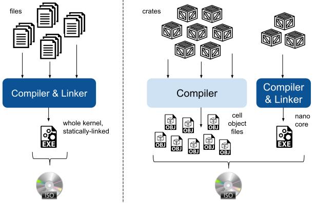

# Configuring Theseus

Theseus source code uses the standard Rust-provided `cfg` options for conditional compilation via build-time configuration. 

We expose the ability to set this via the `THESEUS_CONFIG` environment variable, which can be set on the command line, in the Makefile itself, or in a Rust build script. 

To set one or more cfg options on the command line, all cfg options must be specified in one quoted string, with each individual cfg option separated by whitespace. For example:
```sh
make run THESEUS_CONFIG="cfg_option_1 cfg_option_2"
```

Here's how you would set cfg options in the Makefile. In this case, we set the same `cfg_option_1` whenever `make my_target` is executed:
```mk
my_target : export override THESEUS_CONFIG += cfg_option_1
my_target:
    $(MAKE) run
```

## Using cfg options in Rust source code

In Rust, you can use cfg statements in one of two main ways:
1. As attributes on code blocks, which enable conditional compilation.
    * Below, `foo()` will be compiled as the top block if `cfg_option_1` was set, otherwise `foo()` will be compiled as the bottom block. 
        ```rust,no_run,no_playground
        #[cfg(cfg_option_1)]
        fn foo() {
          println!("cfg_option_1 was enabled!");
        }

        #[cfg(not(cfg_option_1))]
        fn foo() {
          println!("cfg_option_1 was disabled!");
        }
        ```

2. As runtime if-conditionals, which enable runtime use and checking of a statically-known cfg option via the `cfg!()` macro, which returns a boolean value.
    ```rust,no_run,no_playground
    fn foo() {
       if cfg!("cfg_option_1") {
          println!("cfg_option_1 was enabled!");
       } else {
          println!("cfg_option_1 was disabled!");
       }
    }
    ```

Follow the links below to read more about how Rust supports cfg options:
* [Overview of conditional compilation in Rust](https://doc.rust-lang.org/reference/conditional-compilation.html)
* [Rust by example: `cfg`](https://doc.rust-lang.org/rust-by-example/attribute/cfg.html)
* [Rust's cfg!() macro](https://doc.rust-lang.org/std/macro.cfg.html)

 

## How `THESEUS_CONFIG` and `cfg` work together

A single line in the top-level `Makefile` converts the cfg options specified by `THESEUS_CONFIG` into Rust-known `--cfg` values that can be used with the standard Rust cfg attributes. 
That line, shown below, simply adds the "--cfg" prefix onto each whitespace-separated value in `THESEUS_CONFIG` and appends them all to the `RUSTFLAGS` environment variable.
```mk
cargo : export override RUSTFLAGS += $(patsubst %,--cfg %, $(THESEUS_CONFIG))
```
> Note: you can also add `--cfg XYZ` directly to `RUSTFLAGS` rather than use `THESEUS_CONFIG`.

This is a standard approach that avoids the overhead of our prior approach based on a global build script. 
[Read more here](https://doc.rust-lang.org/rustc/command-line-arguments.html#--cfg-configure-the-compilation-environment).


# Other Configuration Options

TODO: describe the new `theseus_features` crate and how it allows one to include optional crates in a Theseus build.


## Debug vs. Release Mode

Theseus can be built in a variety of modes, but offers two presets: **debug** and **release** build modes.
By default, Theseus is built in release mode for usable performance within an emulator like QEMU.
To build in debug mode, set the `BUILD_MODE` environment variable when running `make`, like so:
```sh
make run  BUILD_MODE=debug  [host=yes]
```

As with most languages, release mode in Rust is *way* faster, but can be difficult to debug with GDB.

> Note: Theseus runs *extremely* slowly when built in debug mode; only use it when necessary to debug tricky problems. You will definitely want to run debug builds of Theseus in QEMU using KVM, e.g., by using the above `host=yes` argument on the `make` command.


There is a special Makefile [`cfg/Config.mk`](https://github.com/theseus-os/Theseus/blob/theseus_main/cfg/Config.mk) that contains the build mode options as well as other configuration options used in the kernel Makefile.


## Static Build-time Linking vs. Dynamic Runtime Linking

Theseus offers two primary forms of linking and packaging its compiled crates into an ISO image.
As depicted in the image below, the first (left side) is a conventional fully statically-linked build, as used in all other OSes,
while the second (right side) is a novel dynamic linking approach used for Theseus research. 




### Standard build-time (static) linking
By default, Theseus is built into a single kernel binary just like a regular OS, in which all `kernel` crates are linked into a single static library and then packaged into a bootable .iso file.
This is what happens when you run `make` as usual. 

###  Dynamic runtime linking (`loadable` mode)
However, the research version of Theseus uses full dynamic loading and linking for all crates (except the `nano_core`) to achieve its various goals of live evolution, availability through fault tolerance, flexibility, etc. 
Loading and linking of crates at runtime is precisely how Theseus achieves *runtime-persistent bounds*; the crate management subsystem knows where it loaded a given crate into memory and can therefore maintain metadata about each loaded crate to track its bounds and dependencies. 

We refer to this as `loadable` mode, because crates are loaded at runtime (as cells) instead of being linked into a single static kernel binary.

To enable this, set the `THESEUS_CONFIG="loadable"` option (or run `make loadable`, which sets this for you). This causes the following to occur:

* Builds each crate into its own separate object file as normal, but does not link them all together. 
* Copies each crate's object file into the top-level build directory's module subdirectory (`build/grub-isofiles/modules`) such that each crate is a separate object file in the final `.iso` image.
    * The bootloader loads these object files into memory for us, which we discover and map into memory when initializing the crate management subsystem from the `nano_core`. This allows Theseus to see and load available crate object files at the very beginning of the OS boot-up without needing full support for a filesystem. 
* Sets the `loadable` config option, which as seen in the `nano_core` (and other crates), will enable the `#![cfg(loadable)]` code blocks that dynamically load other crates rather than include them as static dependencies.
    * In `loadable` code blocks, the caller dynamically looks up the symbol for a given callee function and invokes it dynamically instead of directly calling it via a regular function call. This produces a "soft dependency" in the source code rather than a "hard dependency" that actually requires the callee crate to be statically linked to the caller crate.
        * This is somewhat similar to `dlopen()` and `dlsym()` for [loading shared objects on Linux](https://man7.org/linux/man-pages/man3/dlsym.3.html), at least conceptually.
    * Search the code base for `cfg(loadable)` and `cfg(not(loadable))` to see where else it is used. 


## Built-in Rust cfg and target options
The `#[cfg()]` attribute and `cfg!()` macro can also be used with built-in cfg options set by the Rust compiler, for example, target-specific values. 

For example, Theseus frequently uses options like:
* `#[cfg(target_arch = "x86_64")]`
* `#[cfg(target_feature = "sse2")]`

The advantage of these features is that they can also be used in `Cargo.toml` manifest files to conditionally set dependencies. For example:
```toml
## Only include the `core_simd` crate as a dependency when "sse2" is enabled.
[target.'cfg(target_feature = "sse2")'.dependencies.core_simd]
...
```

Unfortunately, you cannot use non-built-in cfg options to conditionally specify dependencies in `Cargo.toml` files, such as anything that comes from `THESEUS_CONFIG` values. 


## Using cargo `features`

Another option for configuration is to expose `features` from a given crate; [read more about features here](https://doc.rust-lang.org/cargo/reference/features.html). 

Theseus does not use features extensively because it is structured as many small crates in one overarching virtual workspace. In this form, you cannot easily set one feature for a target crate across multiple dependent crates at the same time, e.g., using a single command-line argument; instead, you must individually change the Cargo.toml specification of *every single crate* that depends on that target crate. 

Thus, we use the `cfg` blocks instead of `features`. 

That being said, Theseus does choose which features it wants to use when bringing in dependencies on third-party crates, but this is minimal and only occurs for a few dependencies. Typically, features are only specified in order to choose a `no_std` version of a crate, i.e., telling that crate to use the Rust `core` library instead of the standard library.