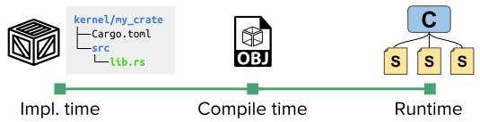

# Theseus's Design and Structure

Theseus is a safe-language OS, in which everything runs in a single address space (SAS) and single privilege level (SPL). 
This includes everything from low-level kernel components to higher-level OS services, drivers, libraries, and more, all the way up to user applications.
Protection and isolation are provided by means of compiler- and language-ensured type safety and memory safety, as explained in a [later section](idea.md).

## Structure of many small *Cells*
Theseus is implemented as a collection of many small entities called ***cells***. 
The cell concept is a term we coined we  to represent an individual entity of code and/or data that can be loaded into Theseus; it is *not* a thread of execution. 
It also has nothing to do with Rust's `std::cell` type. 

Currently, there is a one-to-one relationship between a *cell* and a Rust *crate*. The [crate](https://doc.rust-lang.org/book/ch07-01-packages-and-crates.html) is Rust's project container that consists of source code and a [dependency manifest](https://doc.rust-lang.org/cargo/reference/manifest.html) file. The crate also serves as Rust's translation unit (elementary unit of compilation); in Theseus we configure each Rust crate to be built into a single `.o` object file (a relocatable ELF file). 

Thus, the *cell* abstraction is always present in Theseus, but takes different forms as shown in the below diagram. 
* At implementation time, a cell is a crate.
* After compile (build) time, a cell is a single `.o` object file (relocatable ELF).
* At runtime, a cell (🄲) is a crate's object file that has been dynamically loaded into a region of memory. It contains the set of sections 🅂 from its object file and metadata describing the inter-dependencies between it and others.

In Theseus, the metadata stored for each cell is defined by the `kernel/crate_metadata` crate, which includes the `LoadedCrate` type to represent a single crate loaded into memory (along with its metadata) and the `LoadedSection` type to   structure in the `kernel/crate_metadata` 

# Source code organization
Source code in the Theseus repository is categorized into three main folders:
1. `kernel/`: components that implement the core functionality of the OS
2. `applications/`: user applications, tests, benchmarks, etc that can be invoked to run in Theseus.
3. `libs/`: components that act as standalone libraries usable outside of Theseus.

### 1. Kernel
Crates in the `kernel/` folder are considered to be "first-party" or "privileged" components that can use [unsafe code](https://doc.rust-lang.org/book/ch19-01-unsafe-rust.html) if necessary, e.g., for directly interacting with hardware at the lowest levels of the OS. That being said, we go to great lengths to avoid unsafe code throughout all of Theseus. 

Kernel crates cannot depend on any application crates; if they did, the application crate would be erroneously included and built into the kernel image. Kernel crates can depend on libs crates.

### 2. Applications
Crates in the `applications/` folder are user applications that cannot use any unsafe code. 
Currently this consists mostly of simple utilities and command-line tools that are developed specifically for Theseus, as well as various small apps used to test functionality or run benchmarks for performance measurements.

Application crates can depend on both kernel crates, libs crates, and even other application crates, though the latter is not recommended. 
See [this section](app.md) for more details about how applications work and how to develop one.

In the future, we expect to restrict applications to depend only upon functions and types explicitly exposed through a dedicated library, i.e., `libtheseus`, but this is a future development.

### 3. Libs
Crates in the `libs/` folder are standalone projects that *must not* depend on anything else in Theseus, such as kernel or application crates. They are intended to be re-used by other software projects and may eventually be refactored out of the Theseus repository. The `libs/` folder also includes some other repositories that we may have forked and modified for use by Theseus, often included as [git submodules](https://git-scm.com/book/en/v2/Git-Tools-Submodules) 

### Other folders
The other folders in the root of the repository are mostly build/configuration tools and scripts. Here's a quick rundown:
* `book`: contains the source code of this Theseus book, which you're currently reading.
* `cfg`: contains a project-wide configuration Makefile `Config.mk` and JSON files that specify the compiler target platform for various Theseus builds.
* `docker`: contains scripts and config files required to set up a basic Docker image that can be used to build and run Theseus.
* `scripts`: contains miscellaneous scripts for setting up a build environment, testing, debugging, etc.  
* `tools`: contains custom Rust programs that run as part of Theseus's build process. See the [tools/README](https://github.com/theseus-os/Theseus/tree/theseus_main/tools#readme) file for more.

## Cargo Virtual Workspaces
All of the crates in the main `kernel` and `applications` folders are organized into a single-top level *virtual workspace*, a way of using cargo (Rust's package manager and build tool) to build them all together into the same target directory. 
This ensures they can all be directly linked together against each other and that the dependencies between them will be resolved properly by the compiler and linker toolchains.

You can see how the members of this workspace are defined in the root [Cargo.toml](https://github.com/theseus-os/Theseus/blob/theseus_main/Cargo.toml) file, and how all other folders are ignored. 

## External dependencies
Theseus does depend on many external, third-party crates that are hosted on the official [crates.io](https://crates.io/) registry or on GitHub. This is currently allowed for all crates, no matter whether they are kernel, application, or libs crates. In the future, we may restrict or forbid which kinds of crates can be used by applications and whether they can expose unsafe code or certain underlying assembly instructions. 
