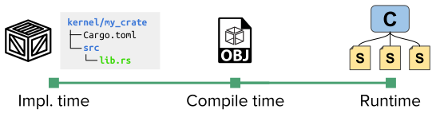
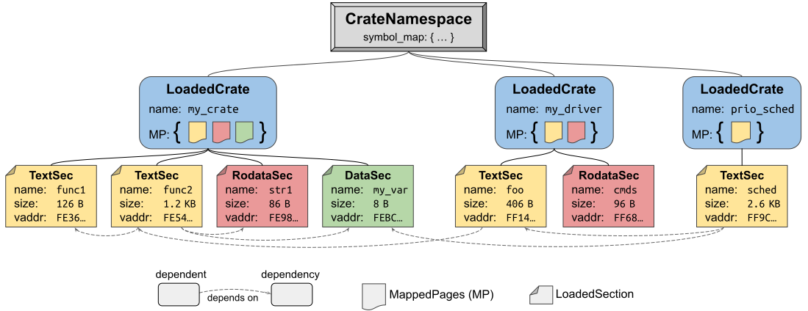

# Theseus's Design and Structure

Theseus is a safe-language OS, in which everything runs in a single address space (SAS) and single privilege level (SPL). 
This includes everything from low-level kernel components to higher-level OS services, drivers, libraries, and more, all the way up to user applications.
Protection and isolation are provided by means of compiler- and language-ensured type safety and memory safety, as explained in a [later section](idea.md).

## Structure of many small *Cells*
Theseus is implemented as a collection of many small entities called ***cells***, a software-defined unit of modularity that acts as the core building block of Theseus.
The cell concept is a term we coined to represent an individual entity of code and/or data that can be loaded into Theseus.
A cell is *not* a thread of execution, nor is it related to Rust's `std::cell` types. 

Currently, there is a one-to-one relationship between a *cell* and a Rust *crate*. The [crate](https://doc.rust-lang.org/book/ch07-01-packages-and-crates.html) is Rust's project container that consists of source code and a [dependency manifest](https://doc.rust-lang.org/cargo/reference/manifest.html) file. The crate also serves as Rust's translation unit (elementary unit of compilation); in Theseus we configure each Rust crate to be built into a single `.o` object file (a relocatable ELF file). 

Thus, the *cell* abstraction is always present in Theseus, but takes different forms as shown in the below diagram. 
* At implementation time, a cell is a crate.
* After compile (build) time, a cell is a single `.o` object file.
* At runtime, a cell 🄲 is a structure that contains the set of sections 🅂 from its crate object file, which have been dynamically loaded and linked into memory, as well as metadata about the inter-dependencies between it and others.

In Theseus, the metadata stored for each cell is defined by [the `kernel/crate_metadata` crate](https://theseus-os.github.io/Theseus/doc/crate_metadata/index.html), which includes two main types:
* `LoadedCrate`, which represents a single crate loaded into memory and linked against other loaded crates. The `LoadedCrate` owns the memory regions holding its sections, along with other metadata about sections and symbols in that crate.
* `LoadedSection`, which represents an individual section within a loaded crate, as specified in its object file. A `LoadedSection` comprises several main items:
    * The section *type*, e.g., `.text` (an executable function), `.rodata` (constant data), `.data`/`.bss` (read-write data)
    * Outgoing dependencies: the list of other sections from other crates that this section depends on (and links against).
    * Incoming dependencies: the list of other sections from other crates that depend on (link against) this section. 
    * References to its containing "parent" crate and location within that crate's memory region where this section is loaded.

Note that dependencies are tracked on a fine-grained, per-section basis in order to facilitate challenging OS goals like live evolution at runtime, system flexibility, fault recovery, and more. 
Dependencies are derived from relocation entries specified in the `.rela.*` sections in the ELF object file. This is much more precise than deriving dependencies from crate-level `Cargo.toml` manifests.

Each cell is loaded and linked into a *namespace*, which we refer to as a `CellNamespace` or `CrateNamespace`, which represents a true namespace of all of the publicly-visible symbols that are exposed by the cells within it. Namespaces are useful for quick dependency (symbol) resolution during dynamic linking, and also play a key role in the above system goals, especially flexibility, as they can be used to efficiently realize multiple distinct *OS personalities* to serve different applications with disparate needs.

The diagram below depicts a simple set of three crates whose sections depend upon each other and are thus linked into a single namespace. The `MappedPages` (MP) objects are Theseus's abstraction of owned memory regions.  <!-- TODO: link to memory.md -->

