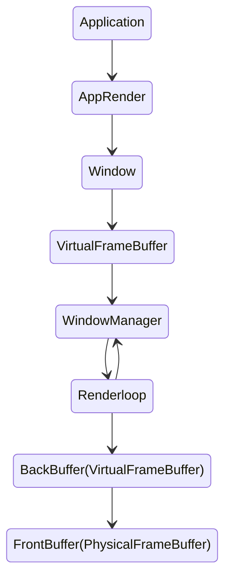

# Porthole 

Theseus display and window management are done by `Porthole` easy to use, a performant graphical subsystem.

## Design

The core design principle of the `Porthole` is removing complexity from an end user while providing good performance.

Before moving on to details we should give a bit more detail about the diagram above. In a typical application, the app will read some data, do operations, and render its content onto `Window`, `Window` will write all of the data that the application wants to render into its framebuffer, in the main loop of `Porthole` `WindowManager` will copy all the data from all the `Windows` into backbuffer, then it will copy all the data into frontbuffer which will update the screen.

### Framebuffer

In Porthole, there are two types of buffers that are crucial to the rendering process: the `VirtualFrameBuffer` and the `PhysicalBuffer`.

The `VirtualFrameBuffer` acts as a backbuffer for the `WindowManager` and for windows it acts as temporary buffer that is to be transferred to main backbuffer.The `PhysicalBuffer` is directly mapped to the pixels on the screen. 

Ideally the end user will not have to interact with the `VirtualFrameBuffer` or `PhysicalFrameBuffer` directly. The `Window` and `WindowManager` are responsible for managing these buffers. The goal is to provide a smooth and seamless experience for the user.

### Window

`Window` in a basic sense is a drawable object, both `WindowManager` and the application holds `Arc<Mutex<Window>>`, it contains information about the position, size, whether or not it's the active window, whether or not it's resized, title, etc...

As expected from most window managers `Window` can be partially moved outside the screen, and resized, it has a title and title bar.

Every `Window` has its own `VirtualFrameBuffer`, which has the same size as the window, when a window is resized window also changes `VirtualFrameBuffer`'s size to match the new size.
Window's `VirtualFramebuffer` always sits at the top-left (x:0,y:0) of the screen.

The window provides various methods to draw and print things, the window only provides these methods to write into its framebuffer which is not directly mapped to actual pixels on the physical screen, but is used by `WindowManager` to write into the backbuffer, the reason for this is quite simple, we want to avoid dealing with complex lifetime related issues that would arise from having multiple window's accessing different parts of a single backbuffer, which also adds lessens our chance of having deadlock.

### WindowManager

The `WindowManager` is relatively straightforward it holds windows via `Vec<Arc<Mutex<Window>>`, it keep their rendering order via `window_rendering_order`.
It has a `VirtualFrameBuffer` that acts as a backbuffer and `PhysicalFrameBuffer` that acts like frontbuffer. It also controls the mouse.

We hold `WindowManager` via `Once<Mutex<WindowManager>>` and it's initalized once by `captain`, after that whenever we need it we can get it by calling `WINDOW_MANAGER.get()`.

Main loop of the `WindowManager` is called `port_loop` at the start of the function we get window manager, after that `loop` starts by getting event from the keyboard and mouse and handling them, be it dragging the window or moving the mouse, we se also send these events to active window via `set_window_event`.

After handling keyboard and mouse events we move on to rendering part of the loop. We start the rendering process by calling `window_manager.lock().update()`. Inside the `update` function we first clear the whole screen by calling `blank()` then, we call `draw_windows` which iterates through the `window_rendering_order` and using that index we get a window from `windows` copy that in to backbuffer repeat until we exhaust the iteration.

We then call `render` function which copies backbuffer and then we finish the loop.

### How Rendering Works, Iterator Case Study

Rust, provides many safety mechanisms to prevent common programming pitfalls, such as dangling pointers, use after frees, and type errors. However, these safety mechanisms come at a cost. For example each time you access an element in a collection that implements `Index`, the runtime performs a bounds check to ensure that you're accessing a valid index. This cost can quickly add up when you're accessing a large collection in a loop that runs as fast as possible.

To address this issue, Rust provides the `Iterator` trait, which allows you to process a collection in a lazy, chunk-by-chunk manner. In the context of rendering, this can lead to significant performance improvements.

Consider a case study where our window has a size of `width: 80, height: 80` and is located at `x: 0, y: 0`. Instead of accessing each pixel individually, we can create an iterator for the `VirtualFrameBuffer` that will allow us to access the data in larger chunks. For example, we can take a row of pixels starting from `0` to `80` from both the window's framebuffer and the backbuffer. Then, we can simply call `copy_from_slice` to copy the data, move to the next row, and repeat.

This approach significantly increased performance compared to accessing each pixel individually. It also makes the code more flexible and easier to maintain. This case study demonstrates the power of Iterators in Rust and how they are used to improve the performance of our rendering operations. For more information on the design and implementation of the Iterator-based rendering, please refer to the file framebuffer.rs.