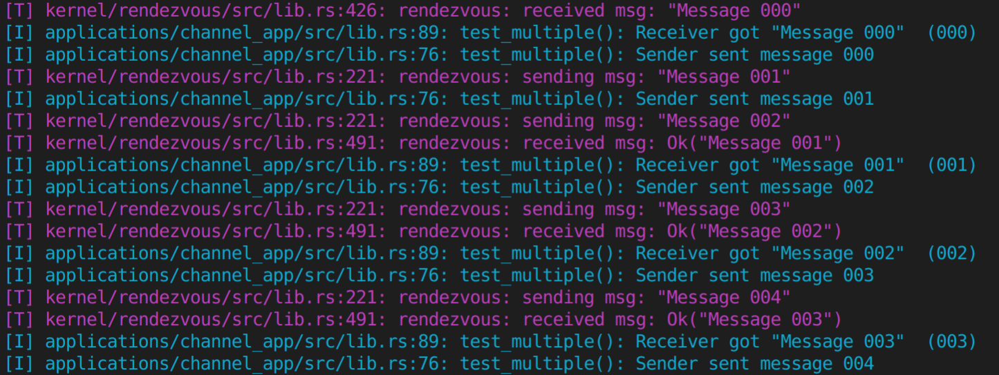
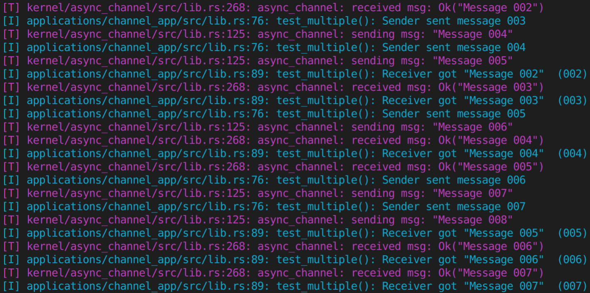

# Live Evolution Evaluation

This README contains the instructions necessary to reproduce the three live evolution scenarios shown in Figure 2 of the submission. All three case studies are described below.
1. [Evolving the scheduler/runqueue from round robin to priority](#-Scheduler-evolution)
2. [Evolving the synchronous rendezvous channels into async channels](#-Inter-task-Communication-Channel-Evolution)
1. [Evolving multiple network layers to fix buggy behavior](#-Network-Usage-and-NIC-driver-Joint-Evolution)


### Dependencies
The live evolution experiments are most easily reproduced by  by downloading updated crates from a "build server" which is simply a local webserver based on Python's SimpleHTTP program. This requires `python2.7` and `rhash`. 
* Run the following: `sudo apt-get install -y python2.7 rhash`

You will also need an environment for building and running Theseus, as described in the [main Theseus README](../../README.md#Building-Theseus). 


### Common arguments
In the instructions below, the `host=yes` argument enables KVM; this is recommended, but technically optional (e.g., if your system doesn't support KVM).     
The `THESEUS_CONFIG=loscd_eval` config argument enables printing of timing measurements for each stage of the evolutionary procedure. 

# Scheduler evolution
This case study evolves Theseus's existing round-robin scheduler (and runqueue) into priority-based ones.

Start with a clean slate:    
`make run`

**[Host shell 1]**     
In one shell, build and run Theseus in loadable mode:     
```
make loadable THESEUS_CONFIG=loscd_eval net=user host=yes
```
You can optionally press `Ctrl+Z` to pause QEMU while doing the next part, and then resume it later with `fg`. 

**[Host shell 2]**     
After Theseus finishes building and is running, open another shell on your host machine. In that new shell, build the priority scheduler update and start the build server using the following command: 
```
make build_server \
     THESEUS_CONFIG="loadable loscd_eval priority_scheduler" \
     UPDATE_DIR=prio STATE_TRANSFER=state_transfer::prio_sched
```

Let the build complete. The build server automatically determines the differences between the first version of Theseus you built in Host shell 1 and the second evolved version you built in Host shell 2, and creates an evolutionary update package in a folder named `$UPDATE_DIR`.    
You should see the build server running, e.g., something like:    
*Starting simple HTTP server at "/<path_to>/.theseus_build_server" with new update "prio"*.

Note: if you accidentally stopped the instance of Theseus in QEMU started in **Host shell 1** before or after the above build server step, don't worry. Just build and run it again using the same command. 

**[Theseus shell]**    
After the build server is ready, switch back to the running instance of Theseus in QEMU, and type the following commands in Theseus's shell to download the evolutionary update:
```
upd dl prio
```

You should observe the build server logging GET requests in the **Host shell 2**, and the Theseus console log (in Host shell 1) showing Theseus’s `upd` app downloading files. 

Once the evolutionary updates are downloaded within Theseus, apply them:
```
upd ap prio
```

After that, the priority scheduler is active and can be observed, e.g., run the `ps` command to see task priorities that did not previously exist. 

If the `loscd_eval` config option was provided, you will see several yellow printouts towards the end of the console log (in Host Shell 1) that list the “Measured time in units of HPET ticks” for various live evolution stages.


# Inter-task Communication Channel Evolution
This case study evolves Theseus's existing synchronous rendezvous channel used for inter-task communication (ITC, like IPC) into an asynchronous buffered channel. 
It can be reproduced very similarly to the above scheduler evolution case.

Start with a clean slate:    
`make clean`

**[Host shell 1]**     
In one shell, build and run Theseus in loadable mode. By default, this will build a version of Theseus that uses the synchronous `rendezvous` channel for ITC.  
```
make loadable THESEUS_CONFIG="loscd_eval trace_channel" net=user host=yes
```

**[Host shell 2]**     
After Theseus finishes building and is running, open another shell on your host machine. In that new shell, build the asynchronous channel update and start the build server using the following command:
```
make build_server \
     THESEUS_CONFIG="loadable loscd_eval trace_channel use_async_channel" \
     UPDATE_DIR=chan
```

Let the build complete and wait for the build server to start, as with the previous scheduler case study.

**[Theseus shell]**    
After the build server is ready, switch back to the running instance of Theseus in QEMU, and type the following commands.     
First, run a channel test application in Theseus's shell. 
```
channel_app
```

While this is running, (if built with the `loscd_eval` config) you can observe Theseus's ITC using a synchronous rendezvous channel implementation.  

Then, evolve Theseus to use asynchronous ITC channels instead. Download the evolutionary updates and then apply them:
```
upd dl chan
upd ap chan
```

If the `loscd_eval` config option was provided, you will see several yellow printouts towards the end of the console log (in Host Shell 1) that list the “Measured time in units of HPET ticks” for various live evolution stages.
If you run the `channel_app` again within Theseus, you will also see that Theseus is using asynchronous channels for ITC instead of the synchronous rendezvous channel it was previously using before the evolution.

The difference in behavior is illustrated below. 
Before evolution, Theseus had a synchronous rendezvous-based (bufferless) channel implementation, so messages are sent and received in lockstep, as shown in this image:    


After evolution, Theseus has an asychronous buffered channel implementation, so multiple successive messages can be sent before the first one is received, as shown in this image:     



# Network Usage and NIC driver Joint Evolution

(e100 NIC driver and HTTP-based update client)

TBD
